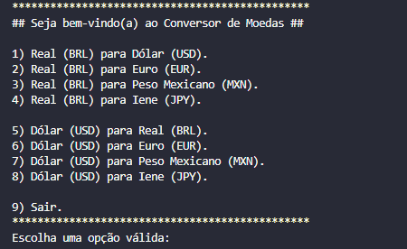
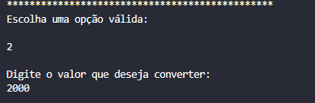
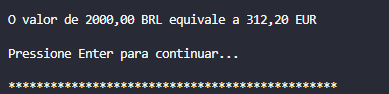
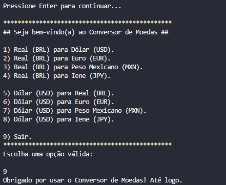
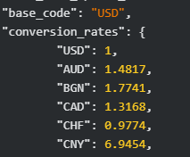

# 📌 Conversor de Moedas com Java


Este projeto foi desenvolvido como parte do desafio **PRATICANDO JAVA – CHALLENGE CONVERSOR DE MOEDAS**. O objetivo é criar uma aplicação em Java que permita ao usuário converter valores entre diferentes moedas, consumindo uma API de taxas de câmbio em tempo real.

## 🚀 Objetivo do Projeto

A aplicação possibilita ao usuário:
- **Escolher uma moeda de origem e uma moeda de destino** para a conversão.
- **Informar o valor a ser convertido**.
- **Consultar taxas de câmbio em tempo real** via API.
- **Exibir o valor convertido** com base na cotação atual.

## 📚 Tecnologias Utilizadas
- **Java**: Linguagem de programação da aplicação.
- **API ExchangeRate-API**: Serviço utilizado para obter taxas de câmbio atualizadas.
- **Bibliotecas**:
  - `HttpURLConnection`: Para requisições HTTP.
  - `Gson`: Para manipulação de JSON.
- **IDE**: IntelliJ IDEA, Visual Studio Code (ou sua IDE de preferência).

## 🔧 Funcionalidades
- 🔄 **Menu de conversão**:
  - Dólar para Real
  - Real para Dólar
  - Euro para Real
  - Real para Euro
  - Libra Esterlina para Real
  - Real para Libra Esterlina

- 🔎 **Consumo da API**: Requisição à API ExchangeRate-API para obter os valores de conversão.
- 📋 **Exibição do resultado**: Apresentação do valor convertido.
- 💾 **Registro de conversões**: Opcionalmente, salvar históricos de conversões realizadas.

## 🛠️ Passo a Passo do Funcionamento da Aplicação

O usuário é recebido com um menu de opções e escolher qual a conversão deseja fazer.


O usuário informa qual tipo de conversão deseja fazer e o valor que deseja converter. No exemplo abaixo o usuário escolheu a opção "2", ou seja, converter de Real para Euro.



A aplicação faz uma requisição à **ExchangeRate-API**, buscando a taxa de câmbio atual entre as moedas selecionadas.
O programa aplica a taxa de câmbio ao valor inserido.
O valor convertido é mostrado ao usuário.



O usuário pode realizar outra conversão ou encerrar a aplicação. No caso, o usuário escolher a opção "9", para encerrar a aplicação. 



## 🌍 Sobre a ExchangeRate-API

A **ExchangeRate-API** é uma API pública que fornece taxas de câmbio atualizadas para diversas moedas. Ela permite a obtenção de taxas de câmbio em tempo real, facilitando conversões entre moedas diferentes. A API responde com um objeto JSON contendo as cotações mais recentes.

Exemplo de resposta da API:



## 📂 Como Executar
1. Clone o repositório do projeto:
   ```bash
   git clone https://github.com/NayaraCalixto/conversor-de-moedas

## 👨‍🏫 Instrutores
- Jacqueline Oliveira
- Paulo Silveira


## 🚀 Projeto do Curso Java One
Este projeto faz parte do desafio proposto no curso <strong>Java One</strong>, com o objetivo de consolidar os aprendizados iniciais em Java através da criação de um sistema prático e funcional.

